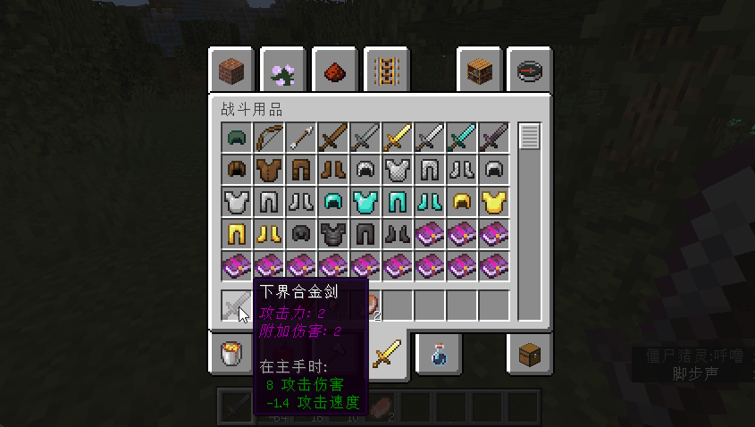

# 属性功能实现

## 读取&记录

[**读取格式**](http://blog.skillw.com/#sort=attributesystem&doc=属性/ReadPattern.md)

## 原版属性公式

例子:
实现 **附加生命** 属性

效果：给实体多加定值最大生命值

声明一个**属性 key** 为 **AdditionHealth** 的属性

> plugins/AttributeSystem/attributes/addition_health.yml

```yaml
AdditionHealth:
  priority: 20
  oriented: entity
  names:
    - "附加生命值"
  read-group: Default
```

> plugins/AttributeSystem/formula.yml

```yaml
attribute-formulas:
  #右值支持以 {id} 的形式带入上面的公式, PAPI/PPAPI 四则运算
  #会影响实体的原版属性 (完全接管)
  max-health: "%as_att:MaxHealth% + %as_att:AdditionHealth%"
  #实测正常摩擦系数下，与2250做商运算
  #结果可以近似实现 %as_att:MovementSpeed%/100 /s
  movement-speed: "%as_att:MovementSpeed% / 2250"
  #默认每10tick(0.5s)恢复一次生命值
  #为了方便实现 %as_att:HealthRegain% /s 故将值除以二
  health-regain: "%as_att:HealthRegain% / 2"
  knockback-resistance: "%as_att:Resistance%"

  #下面只支持玩家
  #单位为 攻击次数/s
  attack-speed: "%as_att:AttackSpeed%"
  #单位为格
  attack-distance: "%as_att:AttackDistance%"
  luck: "%as_att:Luck%"
  #不可被上面的公式调用
skill-api:
  #1.0.6 后与SKAPI技能冷却挂钩
  skill-speed: "{cooldown} * (1- (%as_att:SkillSpeed%/(100-%as_att:SkillSpeed%)))"
```

#### 效果

不用展示了吧，就是加血。

## 战斗机制组公式

例子:
实现 **附加伤害** 属性

效果：每次攻击会造成伤害类型为**Addition**的定值伤害

声明一个**属性 key** 为 **AdditionDamage** 的属性

> plugins/AttributeSystem/attributes/addition_damage.yml

```yaml
AdditionDamage:
  priority: 20
  oriented: entity
  names:
    - "附加伤害"
  read-group: Default
```

> plugins/AttributeSystem/damage/Addition.yml

```yaml
#伤害类型id
Addition:
  #名称
  name: "附加伤害"
  #伤害显示
  display:
    #攻击者
    attack:
      holo: "if({result},!=,0,if({crit},!=,0,&4✵ format({crit},#.##),&6format({damage},#.##)),&7&lMISS) if({vampire},!=,0,&a+format({vampire},#.##), )"
      chat: "&6{name}&5: if({result},!=,0,&dif({crit},!=,0,&4format({crit},#.##),&dformat({damage},#.##)),&7&lMISS) if({vampire},!=,0,&c吸血&aformat({vampire},#.##), )"
      title: "if({crit},!=,0,&4暴击,null)"
      sub-title: "if({result},!=,0,if({crit},!=,0,&4✵ format({crit},#.##),&6format({damage},#.##)),&7&lMISS)"
      action-bar: "&6{name}&5: if({result},!=,0,&dif({crit},!=,0,&4format({crit},#.##),&dformat({damage},#.##)),&7&lMISS) if({vampire},!=,0,&c吸血&aformat({vampire},#.##), )"
    #防御者
    defend:
      holo: "if({result},!=,0,&c- if({crit},!=,0,&4✵ format({crit},#.##),&6format({damage},#.##)),&7&lMISS)"
      chat: "&6{name}&5: if({result},!=,0,&dif({crit},!=,0,&4format({crit},#.##),&dformat({damage},#.##)),&7&lMISS)"
      title: "if({crit},!=,0,&4受到暴击,null)"
      sub-title: "if({result},!=,&c- &6if({crit},!=,0,&4✵ format({crit},#.##),&6format({damage},#.##)),&7&lMISS)"
      action-bar: "&6{name}&5: if({result},!=,0,&dif({crit},!=,0,&4format({crit},#.##),&dformat({damage},#.##)),&7&lMISS)"
```

> plugins/AttributeSystem/fight/default.yml

```yaml
#公式组ID
attack-damage:
  #触发器
  # attack 普通攻击
  # skill-api-技能id-标识符 SkillAPI技能
  # mythic-mobs-伤害标签 MM技能
  # origin-skill-伤害标签
  trigger: attack
  #伤害类型
  Physical:
    #是否启用
    enable: true
    #机制id
    damage:
      #机制数据
      #攻击者变量: {a.PAPI变量/PouPAPI变量}
      #防御者变量: {d.PAPI变量/PouPAPI变量}
      #PouPAPI支持存活实体
      #AS提供的值
      # origin AS处理前的伤害(一般是原版伤害)
      # force 蓄力程度( 弓箭蓄力程度 或 普攻蓄力程度 )
      enable: "if(random(0,1),<,calculate({a.as_att:PhysicalHitChance}-{d.as_att:PhysicalDodgeChance}),true,false)"
      value: "(({a.as_att:PhysicalDamage}+{origin})*(1-({d.as_att:PhysicalDefense}/(100+{d.as_att:PhysicalDefense})))) * {force}"
    #机制从上到下按顺序执行
    crit:
      enable: "if(random(0,1),<,calculate({a.as_att:PhysicalCriticalChance}),true,false)"
      #下面的机制数据可以调用上面已执行机制的执行结果 格式为{id}
      value: "{damage}*(2+{a.as_att:PhysicalCriticalMultiple})"
    vampire:
      enable: "if(random(0,1),<,calculate({a.as_att:PhysicalVampireChance}),true,false)"
      value: "{damage}*({a.as_att:PhysicalVampire_Percent}+{a.as_att:Vampire_Percent})+{a.as_att:PhysicalVampire}+{a.as_att:Vampire}"
  Real:
    enable: true
    damage:
      enable: "if(random(0,1),<,calculate({a.as_att:PhysicalHitChance}-{d.as_att:PhysicalDodgeChance}),true,false)"
      value: "{a.as_att:RealDamage}"
  #下面是新增的
  Addition:
    enable: true
    damage:
      enable: "if(random(0,1),<,calculate({a.as_att:PhysicalHitChance}-{d.as_att:PhysicalDodgeChance}),true,false)"
      #伤害值为附加伤害属性值
      value: "{a.as_att:AdditionDamage}"
```

#### 效果


<br/>

## 脚本监听器

例子:
实现 **跳跃飞升** 属性  
效果：每次跳跃会向上以等额速度冲刺
声明一个**属性 key** 为 **JumpToSky** 的属性

> plugins/AttributeSystem/attributes/damage_pre_sec.yml

```yaml
JumpToSky:
  priority: 20
  oriented: entity
  names:
    - "跳跃飞升"
  read-group: Default
```

> plugins/AttributeSystem/scripts/jump_to_sky.js

```javascript
//Pouvoir的监听器注解 这里需要Paper提供的PlayerJumpEvent
//@Listener(-event com.destroystokyo.paper.event.player.PlayerJumpEvent)
function damagePreSec() {
  const AttributeSystem = Packages.com.skillw.attsystem.AttributeSystem;
  const LivingEntity = Packages.org.bukkit.entity.LivingEntity;
  const Vector = Packages.org.bukkit.util.Vector;
  //属性数据管理器
  var dataManager = AttributeSystem.attributeDataManager;
  //获取玩家
  var player = event.player;
  var uuid = player.getUniqueId();
  //获取属性
  var attribute = AttributeSystem.attributeManager.get("JumpToSky");
  var dataCompound = dataManager.get(uuid);
  //没有这个属性就跳过
  if (!dataCompound.hasAttribute(attribute)) return;
  //属性值
  var value = attribute.readPattern.placeholder(
    "total",
    attribute,
    dataCompound.getAttributeStatus(attribute),
    player
  );
  //同步修改玩家Velocity
  Tool.runTask(function () {
    player.setVelocity(new Vector(0.0, value, 0.0));
  });
}
```

#### 效果


<br/>

## 脚本/代码

例子:
实现 **每秒周围伤害** 属性  
效果：每秒对 5 格内生物造成等额伤害
声明一个**属性 key** 为 **DamagePreSec** 的属性

> plugins/AttributeSystem/attributes/damage_pre_sec.yml

```yaml
DamagePreSec:
  priority: 20
  oriented: entity
  names:
    - "每秒伤害"
  read-group: Default
```

> plugins/AttributeSystem/scripts/damage_pre_sec.js

```javascript
//Pouvoir的JS注解
//@Awake(Enable)
//@Awake(Reload)
function onReload() {
    //获取已有的Task
    var origin = Data.get("damagePreSec")
    //如果有就取消
    if (origin != null) origin.cancel()
    //添加并启动新的Task
    Data.put("damagePreSec", Tool.runTaskAsyncTimer(function () { damagePreSec() }, 0, 20))
}


function damagePreSec() {
    const AttributeSystem = Packages.com.skillw.attsystem.AttributeSystem
    const LivingEntity = Packages.org.bukkit.entity.LivingEntity
    var dataManager = AttributeSystem.attributeDataManager
    //获取属性
    var attribute = AttributeSystem.attributeManager.get("DamagePreSec")
    //遍历所有的属性数据
    for each(var uuid in dataManager.keys) {
        //通过UUID获取LivingEntity
        var entity = EntityUtils.getLivingEntityByUUID(uuid)
        //获取属性数据
        var dataCompound = dataManager.get(uuid)
        //如果没有DamagePreSec属性就跳过
        if (!dataCompound.hasAttribute(attribute)) continue
        //获取属性总值
        var damage = attribute.readPattern.placeholder("total", attribute, dataCompound.getAttributeStatus(attribute), entity)
        //同步进行伤害处理
        Tool.runTask(function () {
            for each(var other in entity.getNearbyEntities(5, 5, 5)) {
            if (!(other instanceof LivingEntity)) continue
            //造成伤害
            other.damage(damage)
            //让实体进入战斗状态
            AttributeSystem.fightManager.intoFighting(uuid)
         }
        })
    }
}

```

#### 效果


