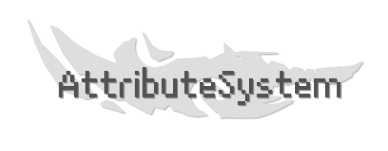

##### **全自定义式**的**属性系统**及**战斗系统**

***

## 插件

|说明|内容|
|--|--|
|兼容版本|1.12.2+|
|硬依赖|Pouvoir|
|软依赖|PlaceholderAPI Mythicmobs SkillAPI|

## 介绍

**AttributeSystem** 是基于 **TabooLib VI** & **Pouvoir** 编写的一款多线程属性插件

#### **简易&客制化**

 你可以仅通过**YAML**配置:

- 注册**属性**
- 注册**属性读取组**
- 注册**伤害类型**
- 注册**伤害公式**
- 注册**属性公式**
- 自定义任何伤害事件的效果&伤害
- 自定义属性的**占位符**/**条件**
- 自定义**玩家/实体槽位**及**条件**
- 自定义**消息提示类型及文本**

> AttributeSytem的伤害公式支持  (普攻/SKAPI/MM技能/Planners)

#### **面向函数**

你可以通过编写 **脚本** / **代码** :

- 注册**伤害机制**
- 注册**物品条件**
- 注册**单行条件**
- 实现**属性功能**
- 实现**自定义触发伤害组**

## 用法

> 下载[**AttributeSystem**](https://www.mcbbs.net/thread-1307249-1-1.html)，**Pouvoir 1.4.0+**，**PlaceholderAPI**(可选)，**Mythicmobs**(可选)，放入 /plugins 文件夹中后重启服务器

## 支持

如果你觉得插件不错，你可以通过 [**爱发电**](https://afdian.net/@glom_) 进行支持