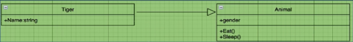
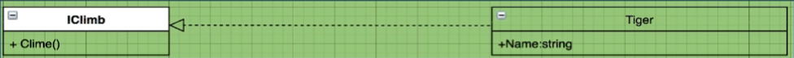
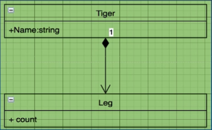
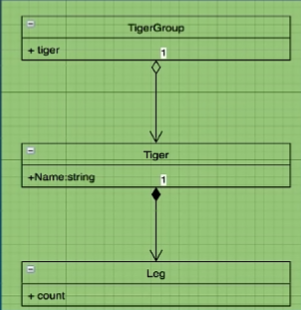
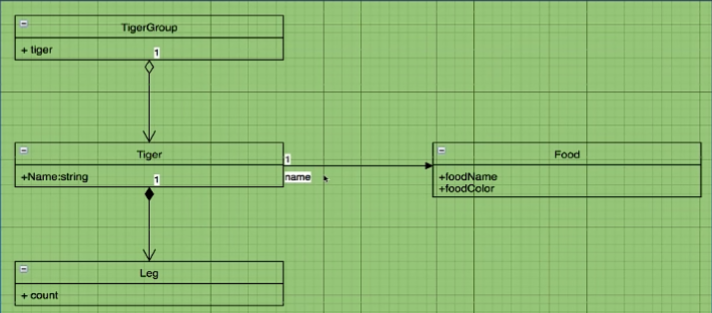
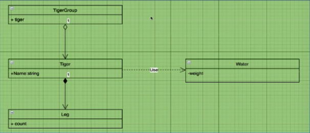
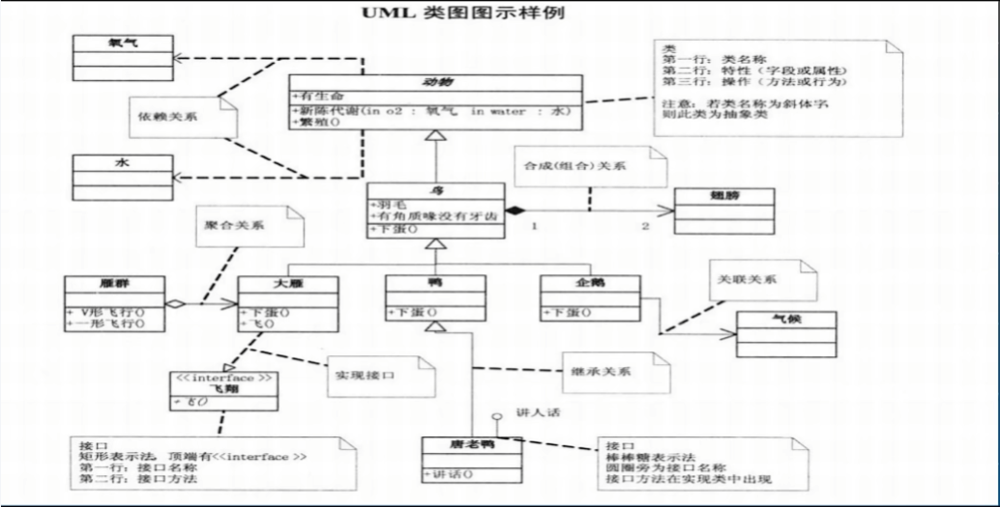

# 类与类之间的关系

#### 泛化 实现 组合 聚合 关联 依赖

## 泛化 (继承)

类与类间的关系

Animal 是 Tiger 的泛化，Tiger 是 Animal 的特化

## 实现

类与接口间的关系

## 组合 (强拥有)

整体和部分的关系

个体/部分没有独立的生命周期，与整体的[生命周期](https://baijiahao.baidu.com/s?id=1699294221762201695&wfr=spider&for=pc)保持一致

组合是把个体类对象作为整体类的成员对象

## 聚合 (弱拥有)

整体与部分的关系

个体有独立的生命周期

聚合是把个体类对象的指针(引用)作为整体类的属性

## 关联

一种拥有关系，不分强拥有弱拥有 （注意与 聚合/组合 的区别）

关联是使一个类知道另一个类的属性或方法

## 依赖

依赖是一种使用关系

## 总结

若 A 要用到 B，则箭头是由 A 到 B

