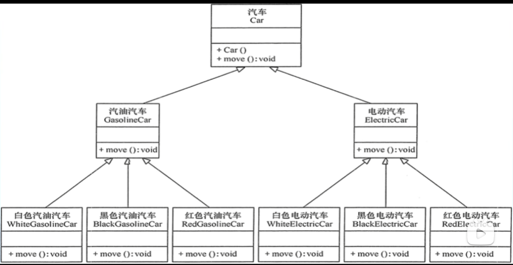
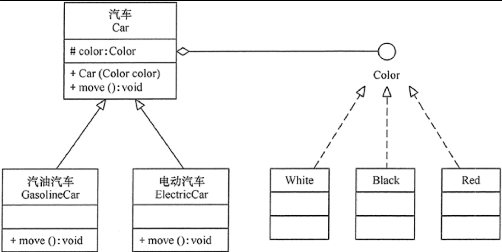

## 合成复用原则 (Composite Reuse Principle) [CRP]

##### 将已有对象纳入到新对象中，作为新对象的对象成员来实现，新对象可以调用已有对象的功能，从而达到复用

- 尽量使用对象组合而不是继承来达到复用

#### 继承的问题

- 破坏了系统的封装性，基类发生了改变，子类的实现也会改变
- 子类可能不需要父类某个方法，那么系统耦合性会变高
- 继承是静态的，不能在运行时发生改变

### 解决方法

"拥有"组合， "是"继承。

上面显得非常臃肿，不符合合成复用原则，下图为解决办法

