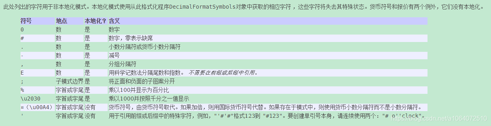

# 字符串内联函数

均支持

- 代入 PAPI / PouPAPI 变量
- 嵌套

## abs

#### 参数

1. 数字

#### 作用

取绝对值

#### 例子

`abs(-100)`

返回 100

## calculate

#### 参数

1. 公式
2. 参数.... (可选)

#### 作用

计算公式

#### 例子

`calculate(10+a,a=100)`

返回 110

可以直接写成

`calculate(10+100)`

返回 110

## ceil

#### 参数

1. 数字

#### 作用

向上取整

#### 例子

`ceil(0.1)`

返回 1

## floor

#### 参数

1. 数字

#### 作用

向下取整

#### 例子

`floor(1.1)`

返回 1

## format

#### 参数

1. 数字
2. 格式

#### 作用

格式化数字

#### 例子

`format(1.12312,#.##)`

返回 1.12

附:

## if

#### 参数

不使用短路与/短路或

1. X 值
2. 判断符
3. Y 值
4. 真返回值
5. 假返回值

使用

1. X 值 1
2. 判断符
3. Y 值 1
4. || 或 &&
5. X 值 2
6. 判断符
7. Y 值 2
8. 真返回值
9. 假返回值

#### 作用

逻辑运算

#### 例子

`if(%player_name%,==,Neige,&&,%player_level%,==,0,太菜了,菜)`

若为 玩家 Neige 且等级为 0

返回 太菜了

否则

返回 菜

## max

#### 参数

1. 数字 1
2. 数字 2

#### 作用

取两者最大值

#### 例子

`max(-100,100)`

返回 100

## min

#### 参数

1. 数字 1
2. 数字 2

#### 作用

取两者最小值

#### 例子

`min(-100,100)`

返回 -100

## random

#### 参数

1. 最小值
2. 最大值
3. 数字格式(可选)

#### 作用

返回区间内随机小数

#### 例子

`random(0,1)`

返回 0.66

(format 参数默认为 #.## )

## randomInt

#### 参数

1. 最小整数
2. 最大整数

#### 作用

返回两整数区间内的随机整数

#### 例子

`random(1,4)`

返回 2

## round

#### 参数

1. 数字

#### 作用

四舍五入

#### 例子

`round(1.233)`

返回 1

## weight

#### 参数

1. 权重::值...

#### 作用

返回权重随机结果

#### 例子

`weight(1::abab,10::aaaaa)`

大概率返回 aaaaa

小概率返回 abab

返回 2
