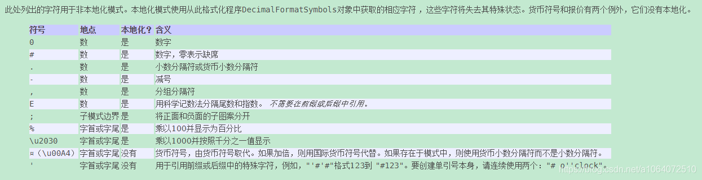

# 字符串内联函数

均支持

- 代入 PAPI / PouPAPI 变量
- 嵌套

# >>>From **Pouvoir**

# 逻辑 [Logic]

## check

#### 参数

1. a 值
2. 判断符号
3. b 值

#### 作用

判断

#### 例子

`check 1 == 1`

返回 true

附:
|判断符|作用|
|:--:|:--:|
|<|比较数字|
|<=|比较数字|
|>|比较数字|
|>=|比较数字|
|==|比较值|
|!=|比较值|
|===|比较内存地址|
|!==|比较内存地址|
|equals|比较值|
|!equals|比较值|
|in|a 是否属于 b 集合/字符串|
|!in|a 是否属于 b 集合/字符串|
|is|a 是否是 b 类的实例|
|!is|a 是否是 b 类的实例|
|contains|a 是否属于 b 字符串|
|!contains|a 是否属于 b 字符串|
|equalsIgnore|a 是否等于 b 字符串 (不论大小写)|
|!equalsIgnore|a 是否等于 b 字符串(不论大小写)|

---

## if

#### 参数

不使用短路与/短路或

1. bool 值 (true / false)
2. then + 真值
3. else + 假值

使用

1. bool 值 (true / false)
2. || 或 &&
3. bool 值 (true / false)
4. then + 真值
5. else + 假值

#### 作用

逻辑判断

#### 例子

`if check %player_name% == 'Neige' && check %player_level% == 0 then '太菜了,菜!' else '菜'`

若为 玩家 Neige 且等级为 0

返回 太菜了,菜!

否则

返回 菜

## all

#### 参数

1. 布尔值列表

#### 作用

满足所有

#### 例子

`all [ check 1 == 2 , check 2 == 2 ]`

返回 `false`

---

## any

#### 参数

1. 布尔值列表

#### 作用

满足其一

#### 例子

`all [ check 1 == 2 , check 2 == 2 ]`

返回 `true`

---

## not

#### 参数

1. 布尔值

#### 作用

取反

#### 例子

`not true`

返回 `false`

---

## return

#### 参数

1. 对象

#### 作用

不执行当前代码块剩下的函数，直接返回值

#### 例子

```
print 1
return 1
print 2
```

输出: `1`
返回: `1`
`print 2`不会被执行

---

# Bukkit

## permission

#### 参数

1. 实体
2. 权限列表

#### 作用

检测实体权限

#### 例子

```
permission &entity [ 'a.b.c' , 'c.b.a' ]
```

若实体有权限`abc`和`c.b.a`则返回: `true` 反之 `false`

---

## sound

#### 参数

1. [声音 ID](https://hub.spigotmc.org/javadocs/bukkit/org/bukkit/Sound.html)
2. Location 直接填对象 或者 构造参数构建
3. 音量 音调 (可选，要写必须一起写)

#### 作用

播放声音

#### 例子

```
sound 'BLOCK_GRAVEL_HIT' [ 'world' , 0 , 64 , 0 ] with 1 1
```

或

```
set loc to invoke &entity getLocation
sound 'BLOCK_GRAVEL_HIT' &loc with 1 1
```

播放声音`BLOCK_GRAVEL_HIT`

# 循环结构 [Loop]

## while

#### 参数

1. 条件，返回布尔值的代码块
2. 标签(可选)
3. 代码块

#### 作用

循环执行

#### 例子

```
set array to arrayOf [ 'a' 'b' 'c' ]
set index = -1
set condition to block {
    set index = calculate '{&index} + 1'
    check &index < list &array size
}
while &condition then {
    print list &array get at &index
}
print 'a'

```

打印:

```
a
b
c
a
```

---

## repeat

#### 参数

1. 次数
2. 传入的`当前次数`参数名
3. 标签(可选)
4. 代码块

#### 作用

循环执行固定次数，传入的`次数参数`从 0 开始，每次加 1

#### 例子

```
set array to arrayOf [ 'a' 'b' 'c' ]
repeat 3 with 'index' then {
    print list &array get at &index
}
print 'a'

```

打印:

```
a
b
c
a
```

---

## foreach

#### 参数

1. 传入参数名(列表/数组中的元素)
2. 列表/数组
3. 标签(可选)
4. 代码块

#### 作用

遍历列表/数组中的元素，并操作

#### 例子

```
set list to listOf [ 'a' 'b' 'c' ]
foreach item in &list then {
    print &item
}
print 'a'

```

打印:

```
a
b
c
a
```

---

## break

#### 参数

1. label 标签(可选)

#### 作用

停止一个循环的执行

#### 例子

```
while { true } lable a then {
    while { true } lable b then {
        print 1
        break the a
    }
    print 2
}
print 'a'

```

打印:

```
2
a
```

---

## continue

#### 参数

1. label 标签(可选)

#### 作用

跳过当前循环，开始下一次循环

#### 例子

```
repeat 5 then {
    print 1
    print 2
    continue
    print 3
}
print 'a'

```

打印:

```
1
2
1
2
1
2
1
2
1
2
a
```

---

# 声明 [Define]

## set

#### 参数

1. 变量名
2. to/= 值

#### 作用

定义变量

#### 例子

`set a to check 1 == 2`

a 赋值为 false
并返回 false

---

## set by lazy

#### 参数

1. 变量名
2. by lazy
3. to/= { 代码块 }

#### 作用

懒汉式定义

#### 例子

`set a by lazy to { check 1 == 2 }`

只定义不赋值，当调用时再赋值
使用`&a`时才开始执行代码块中的内容并赋值`a`

---

## set ifndef

#### 参数

1. 变量名
2. to/= 值

#### 作用

如未定义再定义变量

#### 例子

`set a ifndef to check 1 == 2`

如果变量`a`没有被定义则定义
反之则返回变量`a`的值

---

## block

#### 参数

1. 代码块 (由{}包裹)

#### 作用

生成代码块

#### 例子

`block { print 1 }`

---

## &

#### 参数

1. 变量名

#### 作用

取变量

#### 例子

`&a`
若 a 有值，则返回 a 变量的值
否则返回 '&a'

---

## has

#### 参数

1. 变量名

#### 作用

判断是否有此变量

#### 例子

`has a`
若 `a` 已定义，返回`true`
否则返回 `false`

---

# 数字 [Math]

## abs

#### 参数

1. 数字

#### 作用

取绝对值

#### 例子

`abs -100`

返回 100

---

## calculate

#### 参数

1. 公式
2. 参数.... (可选)

#### 作用

计算公式

#### 例子

`calculate '10+20'`

返回 30

---

## ceil

#### 参数

1. 数字

#### 作用

向上取整

#### 例子

`ceil 0.1 `

返回 1

---

## floor

#### 参数

1. 数字

#### 作用

向下取整

#### 例子

`floor 1.1 `

返回 1

---

## format

#### 参数

1. 数字
2. 格式

#### 作用

格式化数字

#### 例子

`format 1.12312 #.## `

返回 1.12

附:



---

## max

#### 参数

1. 数字 1
2. 数字 2

#### 作用

取两者最大值

#### 例子

`max -100 100 `

返回 100

---

## min

#### 参数

1. 数字 1
2. 数字 2

#### 作用

取两者最小值

#### 例子

`min -100 100 `

返回 -100

---

## random

#### 参数

1. 最小值
2. 最大值
3. 数字格式(可选)

#### 作用

返回区间内随机小数

#### 例子

`random 0 1`

返回 0.66

(format 参数默认为 #.## )

---

## randomInt

#### 参数

1. 最小整数
2. 最大整数

#### 作用

返回两整数区间内的随机整数

#### 例子

`randomInt 1 4 `

返回 2

---

## round

#### 参数

1. 数字

#### 作用

四舍五入

#### 例子

`round 1.233 `

返回 1

---

## weight

#### 参数

1. 权重(整数) to 任意对象 ...

#### 作用

返回权重随机结果

#### 例子

`weight [ 1 to a , 2 to b]`

大概率返回 b

小概率返回 a

# 字符串 [String]

## analysis

#### 参数

1. 字符串

#### 作用

解析字符串

#### 例子

```
set name to 'Neige'
analysis 'hi! i'm a { if check &name == Neige then Neige else Human } !'
```

返回`hi! i'm a Neige`

---

## replace

#### 参数

1. 字符串
2. 替换列表

#### 作用

替换字符串

#### 例子

```
replace ' 咖啡 是sb' [ '咖啡' to 'Glom_' , 'sb' to '帅逼' ]
```

返回` Glom_ 是帅逼`

# IO

## print

#### 参数

1. 对象

#### 作用

向控制台打印字符串

#### 例子

`print 1`

返回 `1`

---

# 对象 [Object]

## import

#### 参数

1. 类路径

#### 作用

导入类

#### 例子

`import 'com.skillw.attsystem.AttributeSystem'`

返回 类对象 AttributeSystem

---

## getField

#### 参数

1. 对象
2. 字段名

#### 作用

获取实例字段的值

#### 例子

`getField &obj 'a'`

返回对象`obj`的实例字段`a`的值

---

## getFieldStatic

#### 参数

1. 对象
2. 字段名

#### 作用

获取静态字段的值

#### 例子

`getField &obj 'a'`

返回对象`obj`的静态字段`a`的值

---

## setField

#### 参数

1. 对象
2. 字段名
3. 值

#### 作用

设置实例字段的值

#### 例子

`setField &obj 'a' '嗨嗨嗨'`

---

## setFieldStatic

1. 对象
2. 字段名
3. 值

#### 作用

设置静态字段的值

#### 例子

`setFieldStatic &obj 'a' '嗨嗨嗨'`

``

返回

---

## invoke

#### 参数

1. 对象
2. 方法名
3. 参数列表

#### 作用

调用实例方法

#### 例子

`invoke &obj 'get' [ 'key' , 'param2' ]`

返回调用对象`obj`的实例方法`get`后的值

---

## invokeStatic

#### 参数

1. 对象
2. 方法名
3. 参数列表

#### 作用

调用静态方法

#### 例子

`invoke &obj 'get' [ 'key' , 'param2' ]`

返回调用对象`obj`的静态方法`get`后的值

---

## type

#### 参数

1. 类型名
2. 对象

#### 作用

强制将对象转换为另一个类型

#### 例子

`type double '111'`

返回类型为`double`的`111`

附:
类型名 double/int/long/float/short/byte/bool/char/string

---

# 集合 [Collection]

## arrayOf

#### 参数

1. 对象列表

#### 作用

生成数组

#### 例子

`arrayOf [ 1 , 2 , 3 ]`

---

## listOf

#### 参数

1. 对象列表

#### 作用

生成 `List`

#### 例子

`listOf [ 1 , 2 , 3 ]`

---

## list set

#### 参数

1. `List` 对象
2. 对象
3. 下标

#### 作用

设置 `List` 下标处的值

#### 例子

`list &list set 'abab' at 1`

---

## list set

#### 参数

1. `List` 对象
2. 对象
3. 下标

#### 作用

设置 `List` 下标处的值

#### 例子

`list &list set 'abab' at 1`

---

## list get

#### 参数

1. `List` 对象
2. 下标

#### 作用

获取 `List` 下标处的值

#### 例子

`list &list get at 1`

---

## list remove

#### 参数

1. `List` 对象
2. 下标

#### 作用

删除 `List` 下标处的值

#### 例子

`list &list remove at 1`

---

## list add

#### 参数

1. `List` 对象
2. 对象

#### 作用

添加 `List` 的值

#### 例子

`list &list add 'abab'`

---

## list contains

#### 参数

1. `List` 对象
2. 对象

#### 作用

判断对象是否在 `List` 中

#### 例子

`list &list contains 'abab'`

---

## list size/clear/isEmpty/toArray/toString

#### 参数

1. `List` 对象

#### 作用

size/clear/isEmpty/toArray/toString

获取总元素数量/删除所有值/是否为空/转为数组/转为字符串

---

# >>>From **AttributeSystem**

> `namespace = attsysem`

## data

#### 参数

- `damage`
  - `get {key}` 获取伤害源，返回的是[OperationElement](https://doc.skillw.com/attsystem/com/skillw/attsystem/api/operation/OperationElement.html)
  - `put {key} with {Number Operation} to {number}` 计入伤害源
  - `remove {key}` 删除伤害源
  - `has {key}` 是否存在伤害源
  - `size` 伤害源总数
  - `clear` 清除伤害源
  - `isEmpty` 是否没有伤害源
  - `keys` 伤害源 key 列表
- `hasResult` 是否命中
- `hasResult to/= true/false` 设置是否命中
- `calMessage` 是否计算战斗信息
- `calMessage to/= true/false` 设置是否计算战斗信息
- `put {key} to {value}` 存数据
- `get {key}` 取数据
- `remove {key}` 删除数据
- `has {key}` 是否有数据
- `size` 数据总数
- `clear` 清除所有数据
- `isEmpty` 是否没有数据
- `keys` 数据 key 列表

#### 作用

操作战斗数据

#### 例子

`data damage put 'crit' with scalar to 100.0`

---
